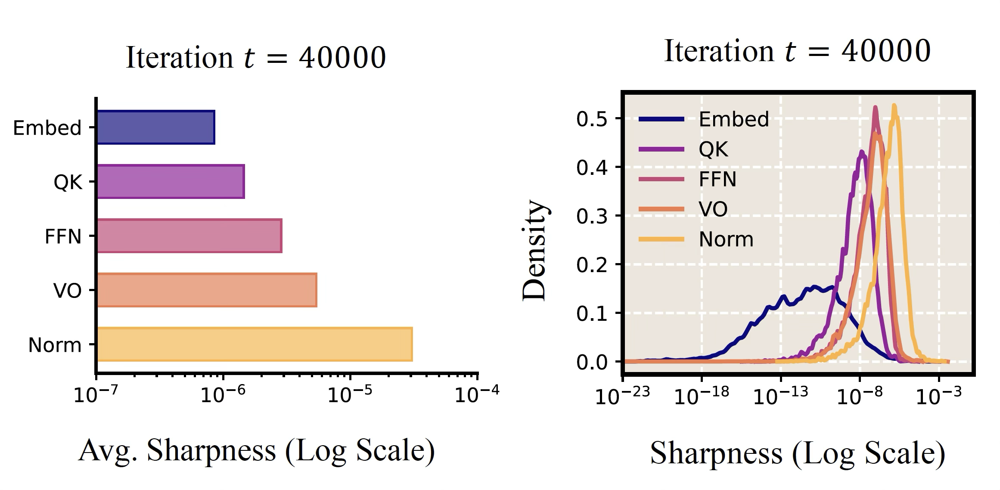
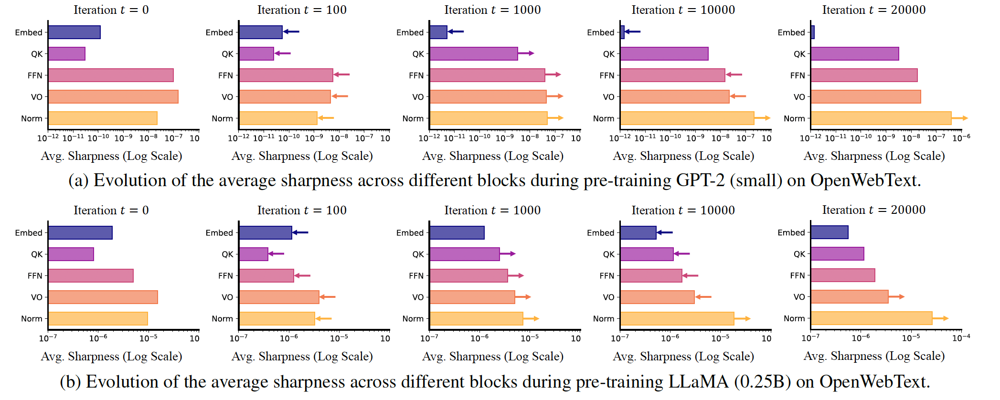
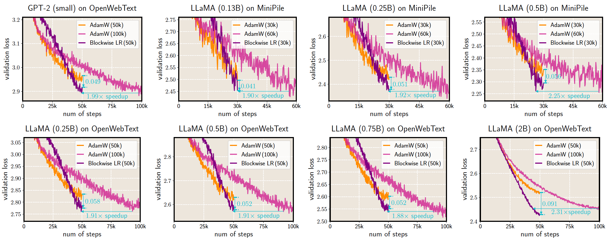
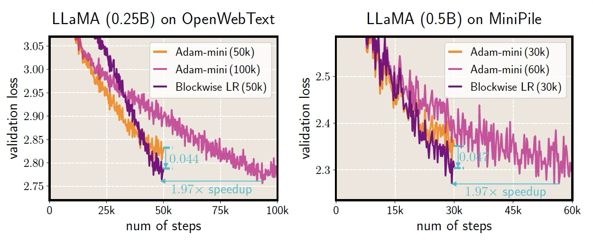
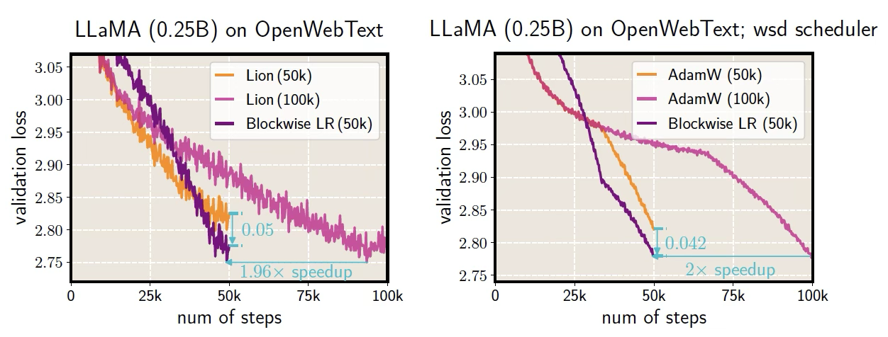
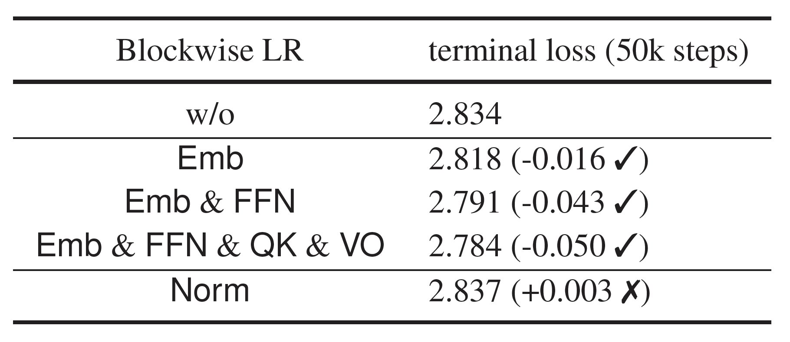
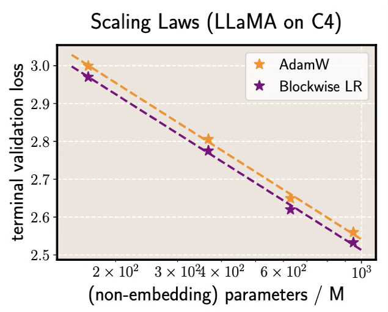
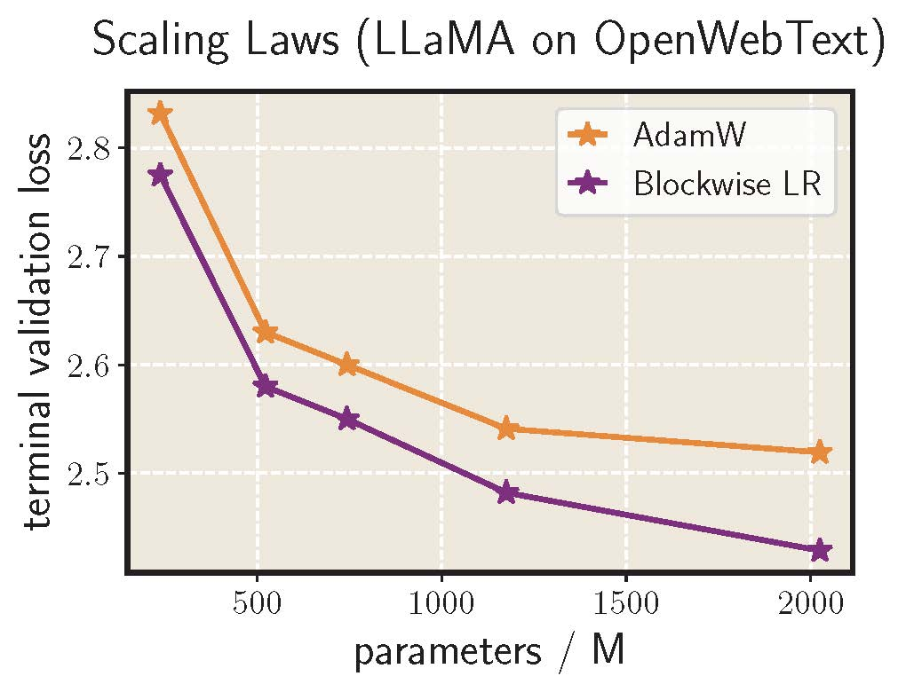

# The Sharpness Disparity Principle in Transformers for Accelerating Language Model Pre-Training

This repository contains the official code for the paper [The Sharpness Disparity Principle in Transformers for Accelerating Language Model Pre-Training](https://icml.cc/virtual/2025/poster/46001)

Authors: Jinbo Wang\*, [Mingze Wang](https://wmz9.github.io/)\*, [Zhanpeng Zhou](https://zzp1012.github.io/)\*, [Junchi Yan](https://thinklab.sjtu.edu.cn), Weinan E, [Lei Wu](https://leiwu0.github.io/)

## Motivation

**Can adaptive layerwise learning rates accelerate Transformer training?**

We investigate this question and make the following contributions:
- uncover a clear sharpness disparity across diverse building blocks of Transformers. (not simply layerwise)
- propose Blockwise Learning Rate (LR), a strategy that tailors the LR to each block’s sharpness, accelerating LLM pre-training. 

## The Sharpness Disparity Principle

Transformers exhibit distinctive **alloy-like characteristics**, where **diverse types of blocks** synergistically combine to achieve superior performance. These blocks include: self-attention (further broken down into *query-key (QK)*, *value-output (VO)*), *point-wise feedforward networks (FFN)*, *normalization layers (Norm)*, and *embedding layers (Emb)*. 

**Key Finding**

By measuring the average sharpness for each block type using Hessian approximation, we uncover a clear sharpness disparity across above blocks (see Figure left): 

$$ 
\mathcal{S}(\textnormal{\textsf{Emb}}) ≪ \mathcal{S}(\textnormal{\textsf{QK}}) < \mathcal{S}(\textnormal{\textsf{FFN}}) < \mathcal{S}(\textnormal{\textsf{VO}}) ≪ \mathcal{S}(\textnormal{\textsf{Norm}}) 
$$

This disparity emerges early and persists throughout training.

<p align="center">

</p>
<p align="center">
<em> Figure. (left) The average sharpness for the five  typical block types in a pre-trained LLaMA model (0.25B) ; (right) the sharpness distribution across different blocks in a pre-trained GPT-2 (small) model.</em>
</p>


<p align="center">

</p>
<p align="center">
<em> Figure. In these experiments, the total training steps are both 50k.  The Sharpness Disparity Principle emerges during the initial phase (from iteration 0 to iteration 1k), which accounts for only approximately 2% of the total steps, and persists throughout the subsequent training process.</em>
</p>


## The Blockwise Learning Rate Strategy

### Methodology

We propose a **Blockwise Learning Rate (LR)** strategy that adjusts the learning rate at the block-type level within the Transformer architecture. Each block type is assigned a different LR multiplier based on its characteristic sharpness:

$$ 
\eta_\textsf{Norm} = \eta_\textsf{base}, \eta_\textsf{VO} = 4\eta_\textsf{base}, \eta_\textsf{FFN} = 6\eta_\textsf{base}, \eta_\textsf{QK} = 8\eta_\textsf{base}, \eta_\textsf{Embed} = 10\eta_\textsf{base}
$$

These ratios are guided by **sharpness disparity** and grounded in the theoretical foundation of the fast-slow dynamics, which suggests increasing the LRs along low-sharpness directions while maintaining stability by preserving the LRs along high-sharpness directions. Each block type is assigned a different LR multiplier based on its sharpness, the specific multipliers above represent a tuned configuration.

## Experiments

### Main results

We consistently achieve lower terminal loss and nearly 2x speedup in a wide range of experiments!

<p align="center">

</p>
<p align="center">
<em>Figure. AdamW with Blockwise LR outperforms AdamW across different model types, model sizes, and datasets.</em>
</p>


<p align="center">

</p>
<p align="center">
<em>Figure. Adam-mini with Blockwise LR outperforms Adam-mini in pre-training tasks.</em>
</p>

<p align="center">

</p>
<p align="center">
<em>Figure. In pre-training tasks, (left) Lion with Blockwise LR outperforms Lion; (right) when using wsd LR scheduler, AdamW with Blockwise LR outperforms AdamW.</em>
</p>

### Ablation Study

<p align="center">

</p>
<p align="center">
<em>Table. Ablation results for the effectiveness of Blockwise
LR in pre-training LLaMA (0.25B) on OpenWebText.</em>
</p>

### Scaling law experiment

<p align="center">
  
  
</p>
<p align="center">
<em>Figure. Scaling law on C4 (under Chinchilla setting); Scaling law on OpenWebText (with fixed training tokens)</em>
</p>


## Citation

```
@inproceedings{
wang2025the,
title={The Sharpness Disparity Principle in Transformers for Accelerating Language Model Pre-Training},
author={Jinbo Wang and Mingze Wang and Zhanpeng Zhou and Junchi Yan and Weinan E and Lei Wu},
booktitle={Forty-second International Conference on Machine Learning},
year={2025},
url={https://openreview.net/forum?id=DZ6iFdVDrx}
}
```

##  Repository Goals
This implementation is not optimized for memory or compute performance: the main goal is to illustrate how blockwise learning rate works, not to achieve a production-ready code. It does not contain code for sharpness statistics currently.

Like nanoGPT, it might be beneficial to keep this code stable (with fixing only bugs) so that it can serve as a consistent reference implementation.

Special Thanks: Many thanks to [Andrej Karpathy](https://github.com/karpathy) for creating the [nanoGPT](https://github.com/karpathy/nanoGPT), which serves as a foundational component of this project.